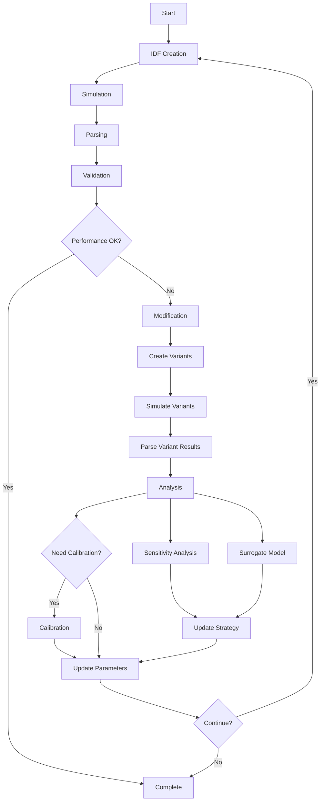

# EnergyPlus 2040 Simulation and Analysis Workflow

## Overview
This document outlines the complete workflow for the EnergyPlus 2040 simulation, analysis, and optimization pipeline. The system supports both human-based and performance-based strategies for building energy modeling and calibration.

## Workflow Components

### 1. IDF Creation
**Purpose**: Generate EnergyPlus Input Data Files (IDF) for building simulations

**Process Flow**:
```
Lookup/Override Values → Parameter Assignment → IDF Creation → IDF File
```

**Key Paths**:
- IDF Objects: `/mnt/d/Documents/daily/E_Plus_2040_py/idf_objects`
- Prompts/Documentation: `/mnt/d/Documents/daily/E_Plus_2040_py/MD_prompt_explorings/idf_creation`
- Implementation: `/mnt/d/Documents/daily/E_Plus_2040_py/orchestrator/idf_creation_step.py`

---

### 2. Simulation
**Purpose**: Run EnergyPlus simulations with appropriate weather data

**Process**:
- Weather file assignment based on location
- Simulation execution
- Output generation

**Key Paths**:
- Weather Files: `/mnt/d/Documents/daily/E_Plus_2040_py/epw`
- Implementation: `/mnt/d/Documents/daily/E_Plus_2040_py/orchestrator/simulation_step.py`

---

### 3. Parsing
**Purpose**: Extract and structure simulation results

**Process Flow**:
```
IDF Parsing → Parsed Parameters
SQL Parsing → Parsed Time Series Data
```

**Key Paths**:
- Parsing Documentation: `/mnt/d/Documents/daily/E_Plus_2040_py/MD_prompt_explorings/idf_parsing`
- Implementation: `/mnt/d/Documents/daily/E_Plus_2040_py/orchestrator/parsing_step.py`
- Parser Library: `/mnt/d/Documents/daily/E_Plus_2040_py/parserr`

---

### 4. Validation
**Purpose**: Compare simulation results with measured/real data

**Process**:
- Load measured data
- Compare with simulation results
- Calculate validation metrics

**Key Path**:
- Validation System: `/mnt/d/Documents/daily/E_Plus_2040_py/validation`

---

### 5. Modification System
**Purpose**: Engine for calibration, surrogate modeling, sensitivity analysis, and scenario development

**Use Cases**:
1. **Calibration Engine**: Adjust parameters to match measured data
2. **Scenario Development**: Create alternative building configurations

**Process Flow**:
```
Define Modification Strategies → Apply Modifications → Create Variant IDFs
```

**Key Paths**:
- Modification System: `/mnt/d/Documents/daily/E_Plus_2040_py/idf_modification_system`
- Implementation: `/mnt/d/Documents/daily/E_Plus_2040_py/orchestrator/modification_step.py`

---

### 6. Variant Processing
**Purpose**: Process modified building variants

**Process**:
1. Create variant IDF files from base target IDF
2. Track modified values
3. Run simulations on variants
4. Parse variant results (IDF and SQL)

---

### 7. Scenario Analysis
**Purpose**: Analyze results from multiple building variants/scenarios

**Features**:
- Comparative analysis
- Performance metrics
- Optimization insights

---

### 8. Sensitivity Analysis
**Purpose**: Identify parameters that most affect building performance

**Process**:
- Parameter perturbation
- Impact assessment
- Sensitivity ranking

**Key Paths**:
- Implementation: `/mnt/d/Documents/daily/E_Plus_2040_py/orchestrator/sensitivity_step.py`
- Sensitivity System: `/mnt/d/Documents/daily/E_Plus_2040_py/c_sensitivity`

---

### 9. Surrogate Model
**Purpose**: Create fast approximation models for optimization

**Process**:
- Define target inputs and outputs
- Train surrogate model
- Validate model accuracy

**Key Paths**:
- Implementation: `/mnt/d/Documents/daily/E_Plus_2040_py/orchestrator/surrogate_step.py`
- Surrogate System: `/mnt/d/Documents/daily/E_Plus_2040_py/c_surrogate`

---

### 10. Calibration
**Purpose**: Optimize simulation parameters to match measured data

**Process**:
- Compare simulation with real data
- Iterate using EnergyPlus or surrogate model
- Update parameters with constraints
- Convergence check

**Key Paths**:
- Calibration System: `/mnt/d/Documents/daily/E_Plus_2040_py/cal`
- Implementation: `/mnt/d/Documents/daily/E_Plus_2040_py/orchestrator/calibration_step.py`

---

## Process Strategies

### A. Human-Based Process
**Characteristics**:
- User specifies initial buildings in configuration
- Manual selection of modification strategies
- User-defined parameter constraints
- Direct control over iteration process

**Configuration Elements**:
```json
{
  "strategy": "human-based",
  "buildings": ["building_1", "building_2"],
  "modifications": {
    "parameters": ["window_u_value", "wall_insulation"],
    "constraints": {...}
  },
  "iterations": 5
}
```

### B. Performance-Based Process
**Characteristics**:
1. Run initial simulation → validation on all buildings
2. Automatically select buildings based on criteria:
   - **Iteration 1**: Failed validation buildings
   - **Iteration 2+**: Best/worst performers based on configuration
3. Apply modifications with increasing intensity
4. Track performance metrics across iterations
5. Stop when criteria met:
   - Performance threshold reached
   - No improvement for N iterations
   - Maximum iterations reached

**Configuration Elements**:
```json
{
  "strategy": "performance-based",
  "selection_criteria": "validation_failure",
  "performance_thresholds": {...},
  "max_iterations": 10,
  "convergence_criteria": {...}
}
```

---

## Key Features

### Selection Strategies
- **Failure-based**: Select buildings that fail validation thresholds
- **Performance-based**: Select top/bottom N performers
- **Improvement-based**: Select buildings showing most/least improvement
- **Clustering-based**: Group similar buildings and select representatives
- **User-override**: Always allow manual selection

### Modification Strategies
- **Targeted**: Modify parameters that most affect failed metrics
- **Progressive**: Start conservative, increase aggressiveness
- **Adaptive**: Learn from previous iterations
- **Exploratory**: Try different parameter combinations

### Loop Control
- **Fixed iterations**: Stop after N iterations
- **Performance target**: Stop when targets are met
- **Convergence**: Stop when no improvement detected
- **Hybrid**: Combine multiple criteria

---

## Iterative Process Flow



---

## Implementation Notes

1. **Modularity**: Each component is independent and can be used standalone or as part of the complete pipeline
2. **Configuration-Driven**: All processes are controlled through configuration files
3. **Tracking**: Complete audit trail of all modifications and results
4. **Scalability**: Designed to handle single buildings to large portfolios
5. **Flexibility**: Supports both automated and manual intervention at any step

---

## Next Steps

1. Define detailed configuration schemas for each component
2. Implement performance monitoring and reporting
3. Create user interface for process visualization
4. Develop automated testing framework
5. Document API interfaces between components